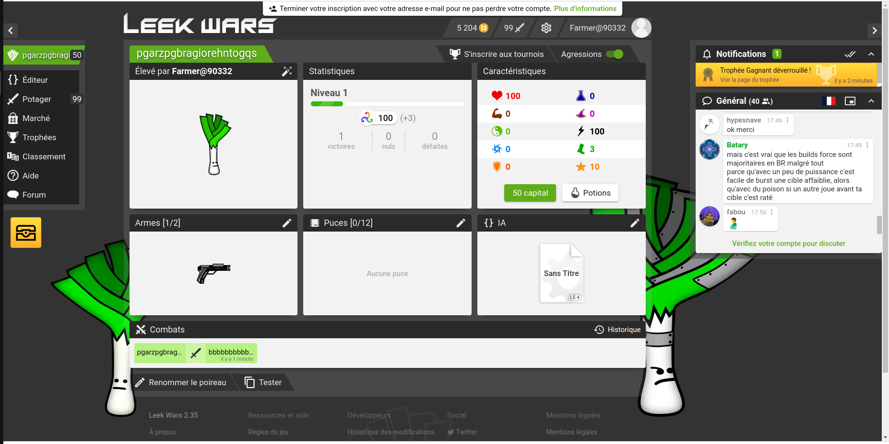
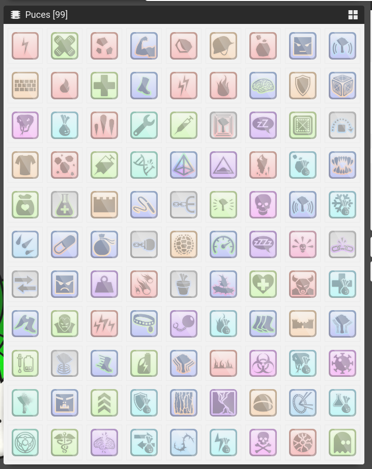

# INTRODUCTION

Bienvenue dans l’univers de Poképoireau. 
 
Bravo à vous jeunes dresseurs, vous avez été recruté pour pouvoir dresser vos poireaux et les faire combattre contre les autres dresseurs.
Pour cela vous allez devoir programmer votre poireau grâce à un langage de programmation proche du `javascript`.

# Environnement

Pour cet atelier vous aller devoir être sur le site `leekwars` [ici](https://leekwars.com/). Vous allez devoir créer un compte.

Une fois que votre compte est créer voici l'interface sur laquelle vous allez être:


Vous pouvez voir différentes informations. Les 6 cases représentent toutes les informations de base de votre poireau

# ON CODE

Si vous regardez à gauche de l'écran vous aller voir un bouton nommé `Editeur`. Si vous cliquez dessus vous allez atterir sur l'éditeur de code. Vous allez pouvoir écrire votre code dans cette fenêtre.

De base votre code ressemble à ça:
```javascript
// On prend le pistolet
setWeapon(WEAPON_PISTOL) // Attention : coûte 1 PT

// On récupère l'ennemi le plus proche
var enemy = getNearestEnemy()

// On avance vers l'ennemi
moveToward(enemy)

// On essaye de lui tirer dessus !
useWeapon(enemy)
```
Comme vous pouvez le voir il y a déja des commentaires qui vous explique ce que fait le code. Vous pouvez les supprimer si vous voulez.
Leekwars vous donne des fonctions déja préprogrammé pour vous aider à faire votre code. Vous pouvez les trouver [ici](https://leekwars.com/encyclopedia).

## L’IA est votre plus grande force  
 
### Il est important de bien connaître son élève 

Votre nouvel ami poireau possède déjà quelques bases en matière de combat, mais elles sont très 
simples et sans votre aide il n’arriva malheureusement pas à progresser. 
Allez dans l’éditeur. Vous trouverez un code généré par défaut. Pour le comprendre, vous devez 
l’observer. Chaque tour, votre poireau va exécuter le code ligne par ligne, dans le sens de lecture. Voici 
à quoi ressemble la première ligne : 
```js
// Take the pistol 
setWeapon(WEAPON_PISTOL); // Warning: cost 1 TP 
```
Comme écrit dans les commentaires, qui est la ligne commençant par `//`, ce code définit l’arme 
en main, ici WEAPON_PISTOL. Chaque action coûte des TP (points de tir), dont le nombre varie selon 
les statistiques de votre poireau. Il est donc inutile d’équiper votre arme à chaque tour, vous le verrez 
par la suite. 
```js
// Get the nearest enemy 
var enemy = getNearestEnemy(); 
```
Cette ligne définit une variable appelée `enemy` qui prend la valeur que `getNearestEnemy` lui 
envoie. Cette valeur correspond à l'identifiant du poireau le plus proche du nôtre. Qui dans le cas en 
1v1, est un ennemi. Par la suite, vous pourrez attaquer l’adversaire en utilisant son ID. 
```js
// Move towards him 
moveToward(enemy); 
```
Ici, votre programme fait avancer votre poireau avec `move` vers l’ennemi  désigné  précédemment. Vous allez ajouter vos premières  modifications à ce code ! Créez une  condition  signifiée par  `if` afin de récupérer le nombre de tours passés et sortir votre arme uniquement si ce dernier est égal à 1:
```js
// Take the pistol 
if (getTurn() == 1) { 
     setWeapon(WEAPON_PISTOL); 
} 
```
Pour tester votre programme, soit vous pouvez utiliser le bouton tester et créer un scenario contre 
Domingo qui est un poireau de votre niveau, soit vous pouvez affronter des inconnus dans potager.  
 
## Hop, hop, hop faut que ça bouge ! 
 
Que diriez-vous d’améliorer les déplacements de votre ami ? Histoire qu’il puisse réagir lorsque se passe  un  évènement  précis.  Commencez  par  changer  la  façon  dont  se  déplace  le  poireau  afin  de diversifier ses mouvements. Vous pouvez le faire reculer, aller à gauche ou à droite lorsqu’il est touché par l’adversaire. Ainsi, ajoutez une action qui va vous permettre d’avancer de 2 et de reculer de 1 : 
```js
// Move towards him 
moveToward(enemy,2); 
// Try to soot him 
useWeapon(enemy); 
// Move away 
moveAwayFrom(enemy, 1); 
```
Vous pouvez par exemple, pour approfondir, déplacer  votre poireau derrière un obstacle afin de 
vous protéger, ou encore amener l’ennemi dans un endroit fermé pour le bloquer. 
 
## Bang bang !! 
 
Vous avez vu  au tout début que votre  poireau ne tirait qu’une fois par tour et dépense trois TP. Maintenant tentez d’asséner plusieurs coups à l’ennemi avec votre arme.  Pour cela, vous allez avoir besoin de connaître vos TP, c’est là que la fonction `getTP()` entre en jeu. Comme son nom l’indique, elle récupère les TP d’un poireau ; ce qui permet d’analyser la situation et de réagir en conséquence. 
```js
// Try to shoot him! 
var my_tp = getTP(); 
```
Désormais votre poireau aura un petit plus comparé à l’IA de base. Et votre ennemi n’aura plus qu’à déguster vos tirs à chaque tour. Cependant, faites attention à vos TP: votre arme en utilise un certain nombre, de l’ordre de 3 pour l’arme de base, ainsi si vous essayez de tirer mais qu’elle n’en a pas assez, votre IA va tourner en boucle sur cette partie du code et donc finir par timeout, c’est à dire que la lecture du code ne s'arrêtera pas et que les actions prévues à la suite ne seront pas réalisées. C’est pourquoi il est conseillé de mettre dans votre condition, qui est la boucle `while`, `my_tp` > [ nombre de TP utilisé par votre arme ] au lieu de `my_tp > 0`. Ci-dessous vous avez l’exemple d’un code qui fonctionnera sans soucis ! 
```js
// Try to shoot him! 
var my_tp = getTP(); 
var shoot = USE_SUCCESS; 
while(my_tp >= 3 and shoot != USE_INVALID_POSITION) { 
    shoot = useWeapon(enemy); 
    my_tp = getTP(); 
} 
```

## La distanciation sociale est la clé ! 
 
Pour  améliorer  vos  déplacements,  il  faut  pourvoir  prendre  en  compte  la  distance  entre  votre champion et votre adversaire. Tout d’abord, récupérez votre position et la position de l’ennemi. Pour cela utilisez la fonction `getCell`. Entrez le code suivant : 
```js
var pos_enemy = getCell(enemy); 
var pos_player = getCell(); 
```

Attention : Votre position (Cell) ne correspond pas à votre ID ! Afin de vous développer, vous pouvez également prendre en compte la distance entre vous et votre ennemi.  Pour  ce  faire,  utilisez  la  fonction `getCellDistance`:  celle-ci  prend  en  paramètres  deux positions, la vôtre et celle de votre adversaire. 
```js
var dist = getCellDistance(pos_player, pos_enemy); 
```
Maintenant que c’est fait, vous pouvez utiliser cette nouvelle donnée pour vous mettre à couvert, 
aller à portée de tir, planifier vos déplacements afin de prendre l’avantage ! 

## C’est l’heure du dudududuel !  

### Les pouvoirs incroyables du poireau :  

Super, bien joué ! Votre progression est fulgurante, et votre poireau plus efficace ! Vous avez eu l'occasion de voir l’utilisation des armes, les mouvements... Mais avez-vous pensé à vous soigner ? À utiliser de la magie pour attaquer votre adversaire de plus loin ? C’est possible grâce aux  puces que vous pourrez acheter en magasin : 


 
Les possibilités sont infinies, choisissez bien vos pouvoirs ! 

### Rafistolez le poireau 
 
Votre  valeureux  compagnon  peut  subir  des  dégâts,  vous  allez  devoir  anticiper  tout  ça,  pour optimiser vos combats. Pour pouvoir effectuer cela, il est nécessaire d’avoir atteint le niveau 3, donc n’hésitez pas à affronter vos voisins, ou des inconnus pour augmenter  votre expérience.  Après cela, vous pourrez acheter la puce CHIP_BANDAGE : 


En effet, c’est un pansement ! 
Vous pouvez désormais la mettre sur votre poireau. Pour cela allez sur l’onglet principal de votre poireau et équipez-la. Une fois que c’est fait, codez la partie permettant de l’utiliser. Essayez de suivre la logique suivante pour la rajouter à votre IA : s’il vous manque de la vie, alors utilisez la puce de soin.  
```js
// health 
var Life = getTotalLife(); 
var life_now = getLife(); 
var my_leek = getEntity(); 
 
if(life_now < Life) { 
   useChip(CHIP_BANDAGE, my_leek); 
} 
```
Votre  légume  peut  maintenant  se  soigner  !  Vous  pourrez  résister  plus  longtemps  sous  le  feu ennemi. Vous pouvez aussi utiliser les puces de protection, qui serviront à prévenir les blessures. 
  
### Déterrez le poireau adverse 
 
Parfait ! Vous commencez à devenir un véritable professionnel. Maintenant améliorez vos attaques en utilisant des sortilèges pour donner une bonne raclée aux ennemies ! Pour commencer à utiliser les sorts d’attaques à distance, vous devez commencer par acheter l'une des puces offensives, qui sont représentées par la couleur rouge.   


Voilà votre sort ! 
 
Comme vous pouvez le voir à côté de la puce, vous avez ici plusieurs infos à propos de celle-ci tel que sa portée, les TP nécessaires pour l’utiliser ou encore les dégâts qu'elle inflige. Pour cette dernière la portée est de 0 à 6 blocs, 2TP sont nécessaires pour l'utiliser et elle fait de 5 à 7 dégâts par utilisation. L'une des premières utilisations que vous en aurez sera : 
```js
// Use Chip_Shock 
useChip(CHIP_SHOCK, enemy); 
```
Ici, vous ne faites qu’utiliser le sort Shock sur l’adversaire. Maintenant améliorez votre algorithme pour  activer  la  puce  si  la  portée  de  votre  arme  est  inférieure  à  votre  distance  à  l'ennemi  ET  que  la portée de votre puce est supérieure ou égale à votre distance à l'ennemi. 
 
### Petit tour à l’armurerie 
 
Que diriez-vous de passer à la vitesse supérieure ? Après tous vos combats, vous devriez pouvoir acheter une nouvelle arme. Le MACHINE_GUN est une arme de départ de choix pour cette nouvelle expérience. Pour l’équiper faites comme pour les chips. Voyons maintenant comment l’utiliser. 
 
 


Voici l’incroyable MACHINE_GUN 
 
Vous avez déjà des fonctions utilisant l’arme. Mais comment en changer ? Utilisez le même principe que pour le tout premier pistolet que vous aviez : 
```js
// Change our weapon 
setWeapon(WEAPON_MACHINE_GUN); 
```
Vous  pouvez  maintenant  ajouter  une  condition  afin  de  choisir  quand  sortir l’arme et ne pas 
dépenser 1 TP à chaque nouveau tour. 
 
##  Découvrez le manuel du savoir ultime 
 
Vous commencez à devenir un expert, le professeur Chêne n’a plus rien à vous apprendre. L’élève a dépassé le maître ! Désormais, vous allez devoir faire vos propres recherches et expériences pour augmenter votre niveau. Mais vous avez de la chance ! Une documentation est fournie par le site. Vous y trouverez toutes les  fonctions  que  vous  n’avez  pas  vu  pour  l’instant.  Il  y  aura  aussi  des  informations  sur  comment réaliser les IA si vous voulez d’autres idées pour votre poireau. Cette partie se trouve dans la partie aide du site. Vous y trouverez les informations sur les différentes fonctions qui existent et que vous pouvez utiliser. Pour cela, vous devez sélectionner la fonction que vous désirez : vous saurez alors quels sont ses paramètres et ses retours. Have fun ! 